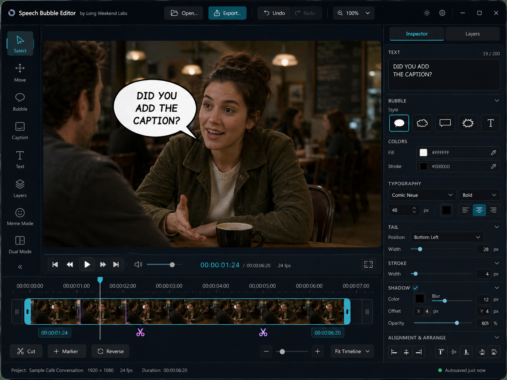

# Speech Bubble Editor

Comic-style speech bubbles, captions, layers, and video edits for desktop.

[](https://github.com/longweekendlabs/speech-bubble-editor/releases/latest)
[](LICENSE)
[](https://longweekendlabs.github.io/speech-bubble-editor/)

Speech Bubble Editor is a native desktop app for placing expressive bubbles and captions on photos or videos. It is built for quick editorial work: open media, add text, shape the bubble, arrange layers, trim or slow video, and export without sending files to a cloud service.



## Download

Get the latest builds from the [download page](https://longweekendlabs.github.io/speech-bubble-editor/) or the [GitHub Releases page](https://github.com/longweekendlabs/speech-bubble-editor/releases/latest).

| Platform | Builds |
| --- | --- |
| Windows x64 | Installer `.exe`, portable `.zip` |
| Linux x64 | AppImage, DEB, RPM, portable `.tar.gz` |
| macOS Intel | App bundle `.zip` |
| macOS Apple Silicon | DMG, app bundle `.zip` |
| Source | `.zip`, `.tar.gz`, or clone this repository |

macOS builds are unsigned. On first launch, right-click the app and choose **Open**.

## Highlights

- Natural speech bubble styles: oval, cloud, rectangle, starburst, text-only, scrim, and caption.
- Draggable bubble tails, resize handles, fill/stroke controls, opacity, shadows, and font styling.
- Photo and video support with timeline controls, trim, cut, reverse, slow-down, and optional audio mute.
- Layer list for stacked images, videos, bubbles, and captions.
- Meme mode and dual mode for fast social-style layouts.
- Full-resolution image export and FFmpeg-powered video export.
- Undo/redo, reset, keyboard shortcuts, and native file pickers.

## Run from Source

Requirements: Python 3.11 or newer.

```bash
git clone https://github.com/longweekendlabs/speech-bubble-editor.git
cd speech-bubble-editor
python -m venv venv
source venv/bin/activate
pip install -r requirements.txt
python main.py
```

On Windows, activate the virtual environment with:

```powershell
venv\Scripts\activate
```

## Build Packages

Official release builds are produced by GitHub Actions, but local scripts are available.

```bash
# Linux
bash build_linux.sh
```

```powershell
# Windows
build_windows.bat
```

```bash
# macOS
python create_icon.py
iconutil -c icns icons/icon.iconset -o icons/icon.icns
python -m PyInstaller --clean --noconfirm speech_bubble_macos.spec
```

## Project Layout

```text
.
├── main.py                 # app entry point
├── main_window.py          # primary window and actions
├── canvas_widget.py        # canvas, selection, drawing, media placement
├── inspector_dock.py       # right-side inspector controls
├── video_controls.py       # timeline and playback controls
├── icons/                  # app icons and Long Weekend Labs logo
├── fonts/                  # bundled fonts
├── theme/                  # Qt stylesheet
└── docs/                   # GitHub Pages website
```

## Release Process

Releases are driven by tags named `v*`.

```bash
git tag v4.0.4
git push origin v4.0.4
```

The release workflow builds Windows x64, Linux x64, macOS Intel, macOS Apple Silicon, and source archives, then attaches them to the GitHub Release.

## License

MIT License. See [LICENSE](LICENSE).

---

Made with ♥ by **[Long Weekend Labs](https://github.com/longweekendlabs)**
