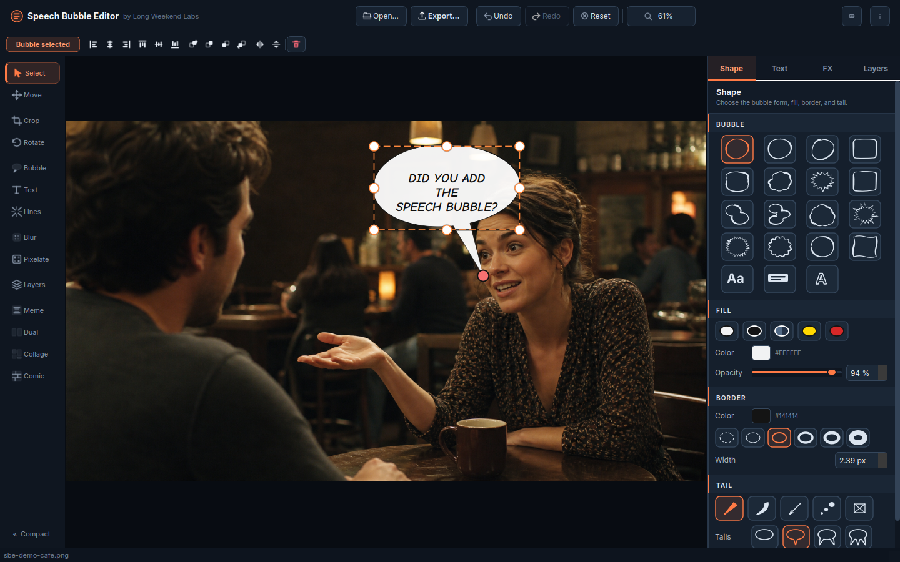
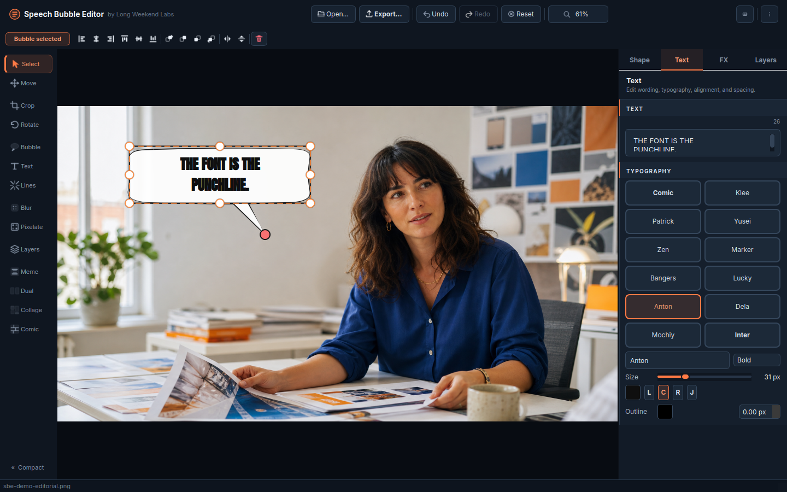
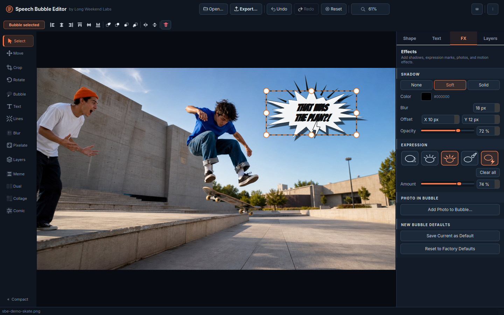
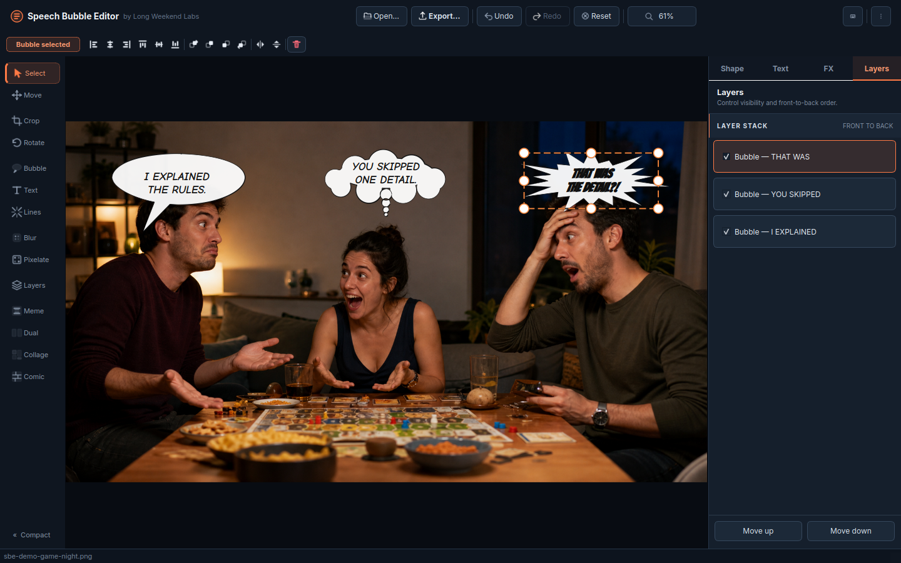

# Speech Bubble Editor

**Speech bubbles, comic pages, photo collages, layers, and video edits for desktop.**

[](https://github.com/longweekendlabs/speech-bubble-editor/releases/latest)
[](LICENSE)
[](https://longweekendlabs.github.io/speech-bubble-editor/)

Drop a photo in, say something over it, and you are done. Speech Bubble Editor turns a picture into a comic panel, a meme, a collage, or a captioned video clip, with hand-drawn bubbles that actually look drawn. Everything runs on your own machine: no account, no upload, no subscription.

### [Download for Windows and Linux](https://github.com/longweekendlabs/speech-bubble-editor/releases/latest)



## Bubbles that look drawn, not stamped

Seven styles: oval, cloud, rectangle, starburst, text-only, scrim, and caption. Each one is inked with a natural, slightly irregular line instead of a perfect vector shape, so a bubble sits on a photo like it belongs there.

Grab the tail and drag it anywhere. Resize from any corner. Set the fill, the outline weight and colour, the opacity, and the shadow. Point the tail at whoever is talking and it stays pointed there while you move the bubble.

 

## Type that carries the joke

Twelve bundled comic and display faces, from Bangers and Permanent Marker to Klee and Yusei Magic, plus Japanese-capable fonts for manga work. Size, weight, alignment, colour, and a proper outline so white text survives a bright background.

Nothing is downloaded at runtime. The fonts ship inside the app and render the same on every machine.

## Comic pages and collages

**Comic Maker** builds 4, 6, 7, and 8 panel hand-inked layouts. Regenerate the layout as many times as you like and your bubbles and photos stay where they are.

**Photo Collage** handles 2 to 9 frames on portrait, square, story, landscape, or photo canvases. Drag a photo from one frame to another and they swap. Move the crop inside a frame without moving the frame. Scale anywhere from 10% to 500%. Fill the gaps with a blur of the photo itself or a solid colour. Save any arrangement as a named preset.

## Effects and layers

Lines, blur, and pixelate that follow whichever frame you are working in, so a speed line does not spill into the panel next door. Blur and pixelate double as a quick way to hide a face or a licence plate.

The layer list covers images, videos, bubbles, and captions together. Reorder by dragging, hide anything without deleting it, and pull one element to the front without hunting for it on the canvas.

 

## Video, not just stills

Open a clip and the timeline appears. Trim the ends, cut a section out of the middle, reverse it, slow it down, or mute the audio. Bubbles and captions ride on top and export with the video. FFmpeg is bundled, so there is nothing to install alongside.

## Meme mode and dual mode

Two one-click layouts for the formats people actually post: classic top and bottom meme text, and a stacked two-panel setup for reaction shots.

## The rest

Full resolution image export. Undo and redo everywhere. Keyboard shortcuts for the things you repeat. Your operating system's own file dialogs, not a toolkit imitation. A dark interface that stays out of the way of the picture.

## Download

Windows and Linux x64 builds are on the [**releases page**](https://github.com/longweekendlabs/speech-bubble-editor/releases/latest): a Windows installer and portable zip, and an AppImage, RPM, DEB, and tar.gz for Linux. The [download page](https://longweekendlabs.github.io/speech-bubble-editor/) picks the right one for you.

## Feedback

[Open an issue](https://github.com/longweekendlabs/speech-bubble-editor/issues) for a bug or a request. To write privately, email [iemrecnl@gmail.com](mailto:iemrecnl@gmail.com?subject=Speech%20Bubble%20Editor%20feedback) and mention your version, shown in the More menu under About.

## Build from source

Not needed to use the app. Requires Python 3.11 or newer.

```bash
git clone https://github.com/longweekendlabs/speech-bubble-editor.git
cd speech-bubble-editor
python -m venv venv
source venv/bin/activate      # Windows: venv\Scripts\activate
pip install -r requirements.txt
python main.py
```

## License

MIT License. See [LICENSE](LICENSE). Free and open source: no licence key, no trial, no subscription.

© 2026 Long Weekend Labs

---

Made with ♥ by **[Long Weekend Labs](https://github.com/longweekendlabs)**
